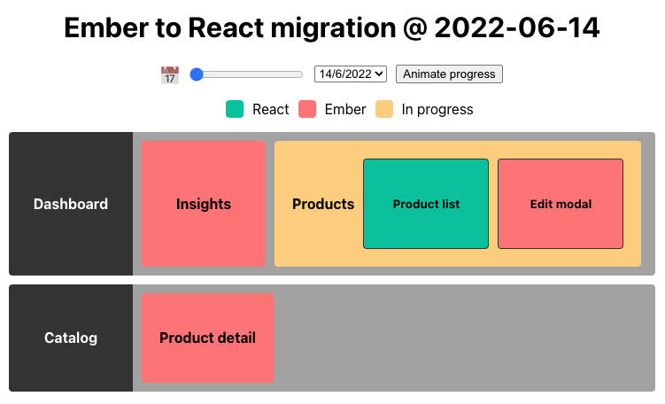
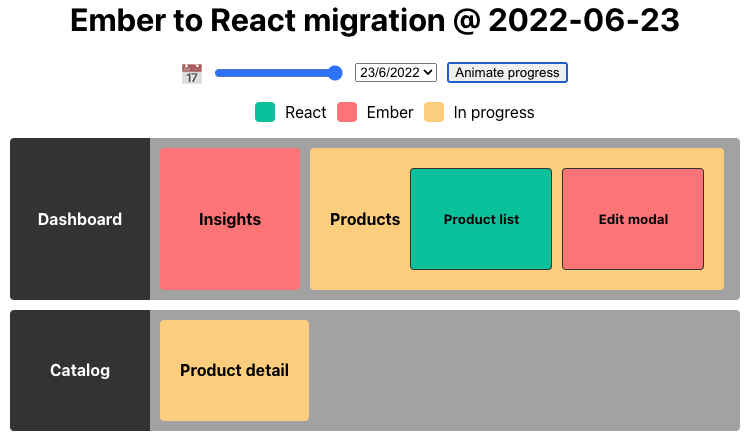
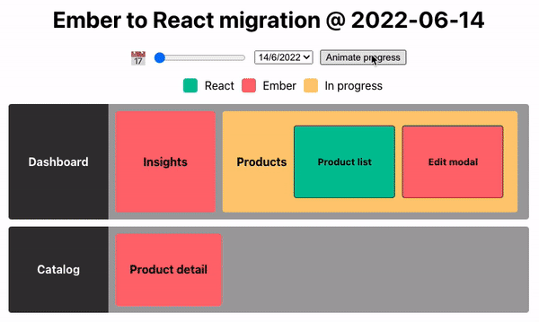
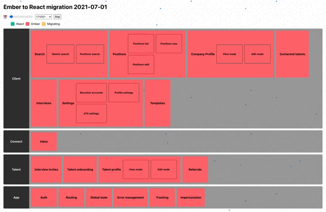
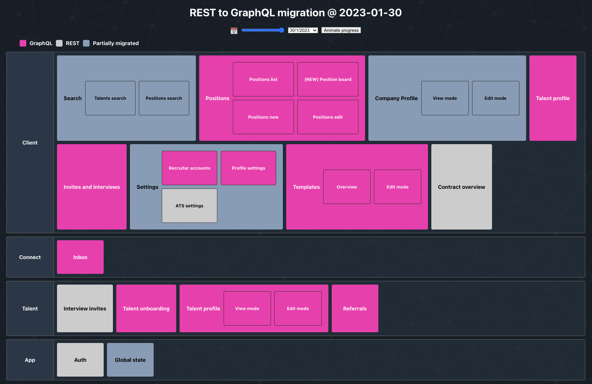

# MigrationUI

MigrationUI is a dashboard that helps your team track progress when migrating from technology A to technology B. It represents visually what has changed and what is still pending at a glance, and also let's you time travel to check that progress in time. Think of it as a TODO list but represented in a more graphical way and with a history.

## How to update progress

The project follows a migrations approach where you will define which data has changed on a given date. Your migrations live in the `migrations.ts` file.

A migration consists of a `date` and an `operation`.

- `date`: the date when the data was modified. It's actually a string so it could be whatever suits you best, but we recommend using a valid Date format.
- `operation`: a function that receives a copy of the previous data state. You can make direct changes to that copy and the data will update accordingly (thanks to [Immer.js](https://immerjs.github.io/immer/) which we use under the hood)

## Data structure

You can visually map your project using two dimensions.

- `section`: each layer or logical agroupation of Elements in your project or app.
- `element`: each individual project that can be tackled independently in your migration project.

## Running the project

You can check your changes locally running the `npm start` command.
If you want to build it and publish somewhere else then run `npm build` instead and upload the output of the _(build)_ folder to your favourite hosting.

## How to use in your own project

1. Fork this project
2. Adjust your labels and colors modifying the _(src/config.ts)_ file accordingly.
3. Customize the `initialData` object _(src/initialData.ts)_ with your data structure. For example:

```typescript
const initialData = {
  sections: {
    dashboard: {
      label: "Dashboard",
      elements: {
        insights: {
          label: "Insights",
          progress: Progress.notDone,
        },
        products: {
          label: "Products",
          progress: Progress.inProgress,
          elements: {
            list: {
              label: "Product list",
              progress: Progress.done,
            },
            edit: {
              label: "Edit modal",
              progress: Progress.notDone,
            },
          },
        },
      },
    },
    catalog: {
      label: "Catalog",
      elements: {
        product: {
          label: "Product detail",
          progress: Progress.notDone,
        },
      },
    },
  },
};
```

This will be the output with the initial state of your application:



4. Start tracking your team progress with the migration! For that purpose you'll need to edit the `migrations` object _(src/migrations.ts)_ as follows, in order to perform changes over the `initialData` object.

In this case, we'll want to reflect that our team has started working on the **Product detail** of the **Catalog**.

```typescript
const migrations: MigrationType[] = [
  // This is the date when your team started the migration process
  { date: "2022-06-14", operation: () => initialData },
  // ↓↓↓↓ Here below will go your progress ↓↓↓↓
  {
    date: "2022-06-23",
    operation: (prevData) => {
      prevData.sections.catalog.elements.product.progress = Progress.inProgress;
    },
  },
];
```

As you can see, now the **Product detail** box is yellow, cause it's in progress or partially migrated:



5.  🚧 More progress! 🛠

```typescript
const migrations: MigrationType[] = [
  // This is the date when your team started the migration process
  { date: "2022-06-14", operation: () => initialData },
  // ↓↓↓↓ Here below will go your progress ↓↓↓↓
  {
    date: "2022-06-23",
    operation: (prevData) => {
      prevData.sections.catalog.elements.product.progress = Progress.inProgress;
    },
  },
  {
    date: "2022-07-02",
    operation: (prevData) => {
      prevData.sections.catalog.elements.product.progress = Progress.inProgress;
    },
  },
  {
    date: "2022-07-02",
    operation: (prevData) => {
      prevData.sections.catalog.elements.product.progress = Progress.done;
      prevData.sections.dashboard.elements.products.elements.edit.progress =
        Progress.inProgress;
    },
  },
  {
    date: "2022-07-19",
    operation: (prevData) => {
      prevData.sections.dashboard.elements.products.elements.edit.progress =
        Progress.done;
      prevData.sections.dashboard.elements.products.progress = Progress.done;
    },
  },
  {
    date: "2022-07-21",
    operation: (prevData) => {
      prevData.sections.dashboard.elements.insights.progress =
        Progress.inProgress;
    },
  },
  {
    date: "2022-08-10",
    operation: (prevData) => {
      prevData.sections.dashboard.elements.insights.progress = Progress.done;
    },
  },
];
```

6. And... 🎉 🎉 Finally! 🎉 🎉



## Customisation options

Here's a list of all the attributes that you can easily style in this dashboard through the _src/config.ts_ file:

| Attribute                                    | Description                                                         |
| -------------------------------------------- | ------------------------------------------------------------------- |
| `title`                                      | Page title.                                                         |
| `theme.background`                           | Background of the page, could be a color, an image, etc.            |
| `theme.color`                                | Page text color.                                                    |
| `theme.boxBorder`                            | Border color of each box on the page.                               |
| `theme.sectionHeaderBackground`              | Background of the section header.                                   |
| `theme.sectionHeaderColor`                   | Text color of the section header.                                   |
| `theme.sectionBodyBackground`                | Background of the section body, which contains the element boxes.   |
| `elementProgress.[progress].legendLabel`     | Label used in the legend to represent the progress of each element. |
| `elementProgress.[progress].backgroundColor` | Background of the element box which is in this state.               |
| `elementProgress.[progress].color`           | Text color of the element box which is in this state.               |

## Check how we used this at Honeypot

| [Ember to React](https://honeypotio.github.io/ember-to-react/) | [REST to GraphQL](https://honeypotio.github.io/rest-to-graphql/) |
| -------------------------------------------------------------- | ---------------------------------------------------------------- |
|                    |                    |

Migration UI Icon provided by
<a href="https://www.flaticon.com/free-icons/exchange" title="exchange icons">Exchange icons created by Freepik - Flaticon</a>
